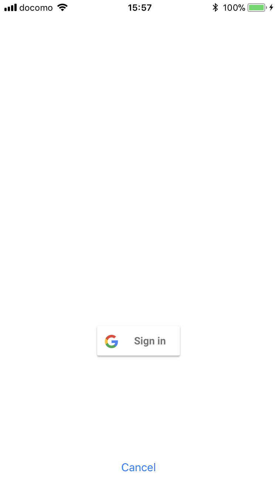
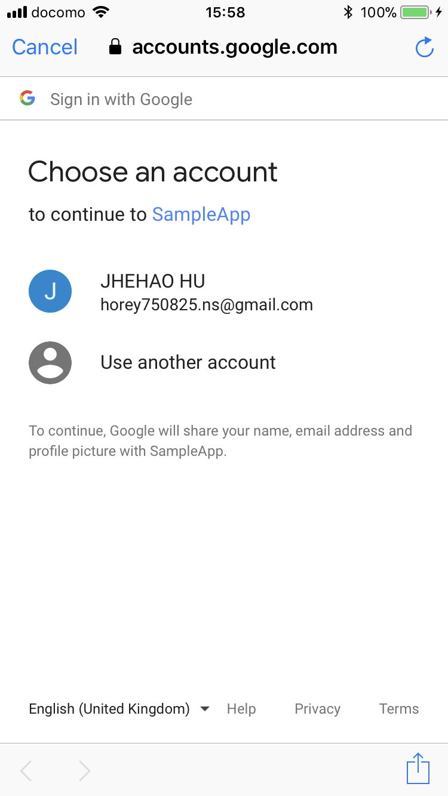
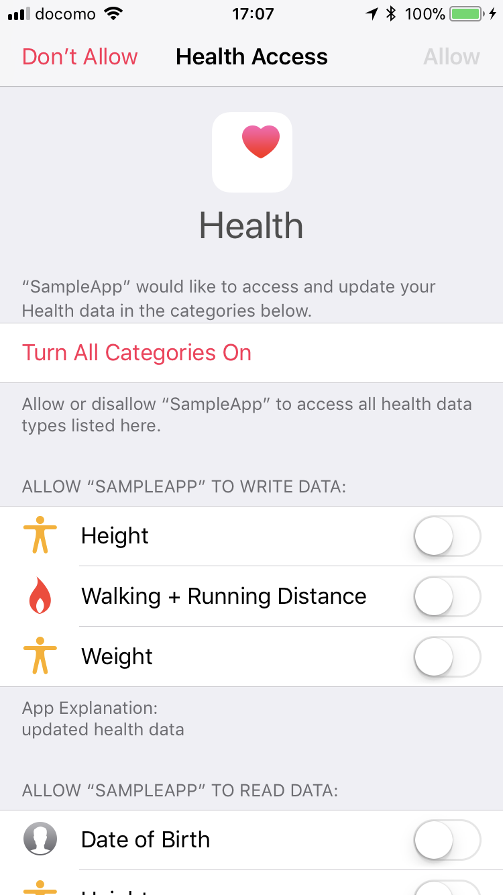
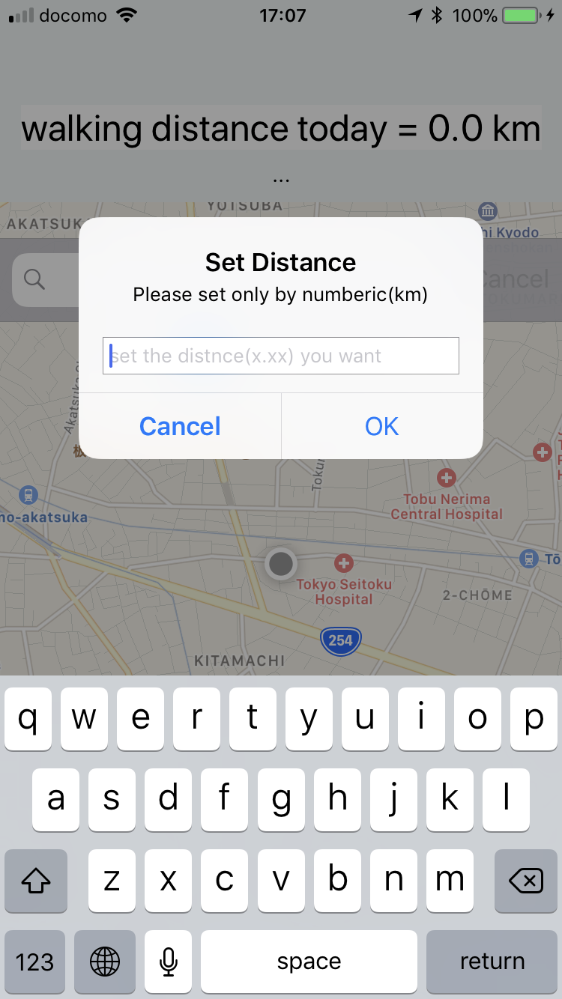
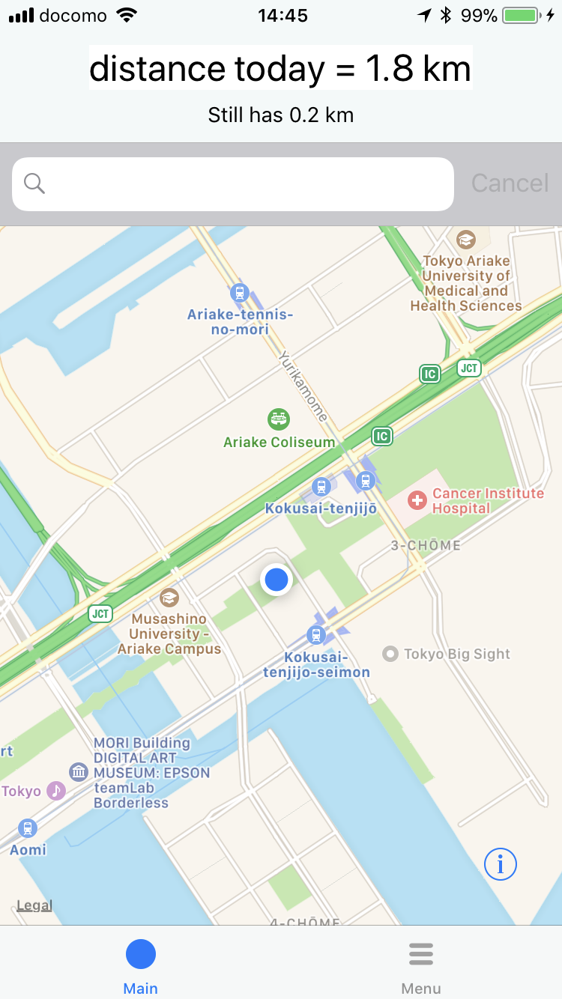
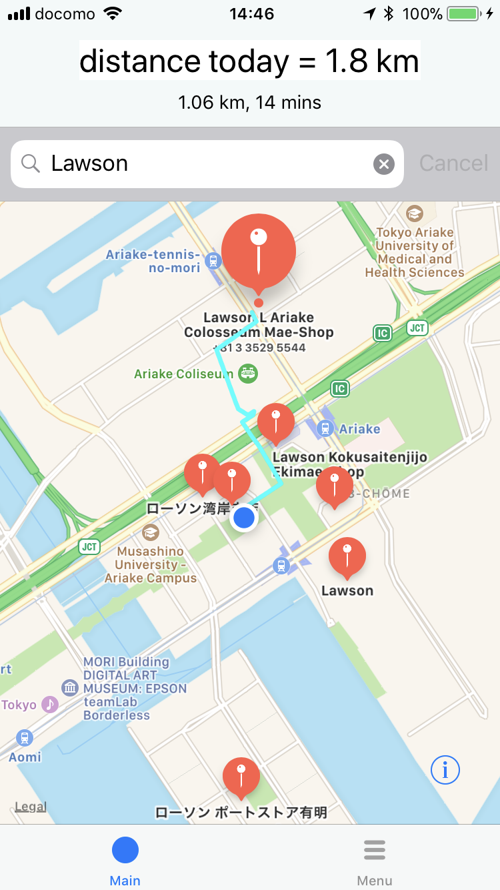
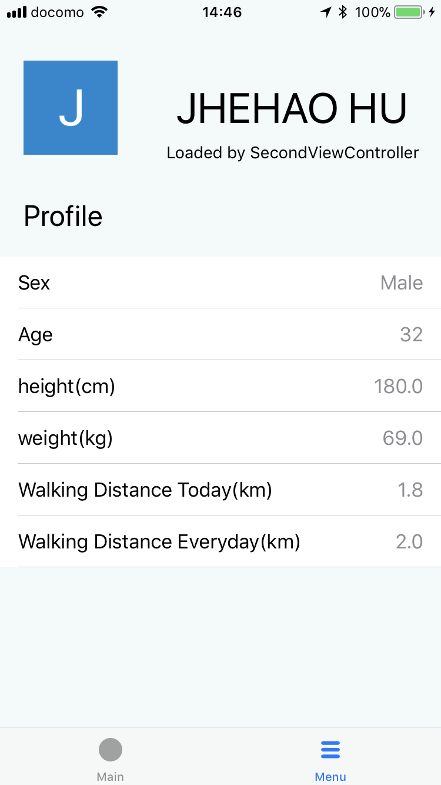

# SampleApp

This app is developed by Swift 4.1.

* MapKit
    * Get the current position
    * Search the store and calculate the distance

* GoogleSingIn
    * get the user name and image.
* HealthKit
    * get the user information
        * Height
        * Weight
        * Age
        * Sex
        * The walking distance today

## UserGuide

- This app will get the Walking distance today.
- User can set the distance that want to walk everyday.
- App will show the distance user should walk today
- User can search a store and app will show the distance to store.
- Example : User still has 2 KM to complete the walking goal. Now User want to go to convenient store, so user search the store name and the map will show the stores. User can touch each store to know the distance between store. After all the user can choose a store of distance 2km to complete walking goal.

## Screenshots

 

 

 

 

 

 

 